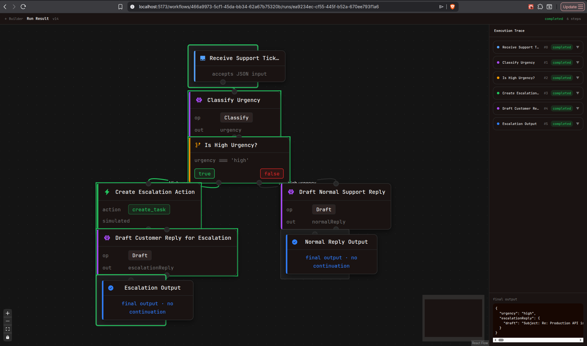
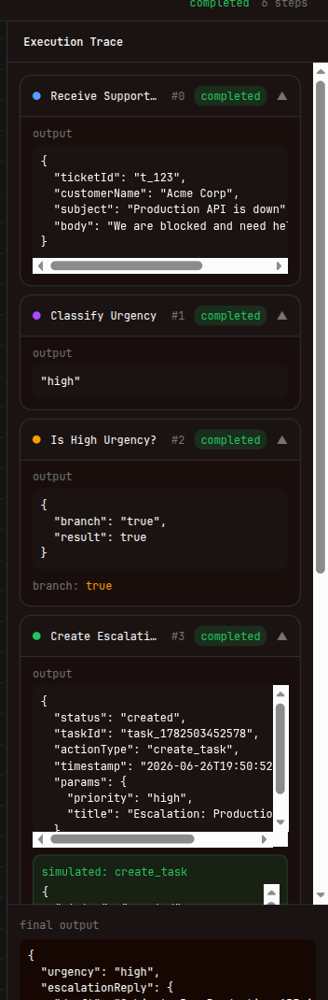
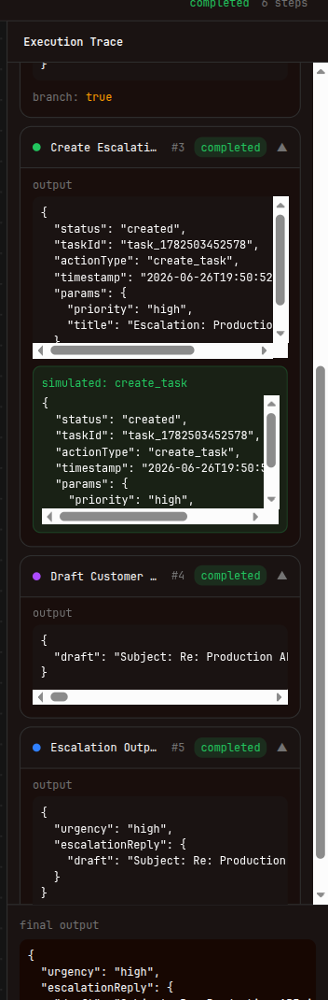

# Live Build: AI Workflow Studio

## What We Built

AI Workflow Studio is a small end-to-end workflow builder for the live-build prompt. The core idea is simple: a user describes a workflow in natural language, the backend compiles that description into a bounded structured workflow, and the app can run that workflow on sample JSON while showing a step-by-step execution trace.

The implementation is split into a NestJS backend and a Vite React frontend. The frontend gives the user a workflow list, a React Flow builder, a natural-language generation panel, a JSON run modal, and a run result view. The backend owns the durable workflow model, OpenRouter integration, workflow validation, deterministic execution, run storage, trace storage, simulated action records, and approval pause state.

This is intentionally a tiny workflow studio, not a Zapier clone. The workflow language is constrained to a small palette:

- `input`
- `llm`
- `condition`
- `template`
- `approval`
- `action`
- `output`

That constraint is the main product and engineering decision. It keeps the LLM useful without letting it invent arbitrary tools, code, or real external side effects.

## User Flow

The app supports the required flow from the prompt:

1. Create a workflow from the workflow list.
2. Open the builder.
3. Use the Generate tab to describe the workflow in natural language.
4. Send that description to the backend compiler.
5. Inspect the generated graph on the React Flow canvas.
6. Save the current graph as a workflow version.
7. Run the latest version with JSON input.
8. Inspect the run result, graph status, step trace, simulated actions, errors, and final output.

The run result screen is not just a raw JSON dump. It reuses the same graph components from the builder in a read-only viewer and highlights execution status from the run trace. A side panel lists every executed step, its status, output, branch decision, simulated action result, and final output.

## Stack

The project uses a TypeScript split app:

- Backend: NestJS, TypeScript, Zod, `better-sqlite3`
- Frontend: React, Vite, React Router, React Flow via `@xyflow/react`, Tailwind CSS
- LLM: OpenRouter, read from `OPENROUTER_API_KEY`
- Storage: local SQLite database at `backend/data/workflow-studio.db`

SQLite was chosen even though the prompt allowed in-memory storage. Workflows are retainable, and the data model naturally wants versioned workflow definitions and historical runs. SQLite keeps setup simple while still making the backend architecture look like a real product instead of a demo object in memory.

## Backend Architecture

The backend is organized around four responsibilities:

- Workflows module: workflow CRUD and workflow versions
- Compiler module: OpenRouter-backed natural-language compilation
- Runs module: run creation, run lookup, trace persistence
- Runner: deterministic execution of validated workflow definitions

The important separation is that the LLM does not execute the workflow. The LLM only produces a candidate workflow definition. The backend validates that definition, normalizes some common model mistakes, stores it as a version, and later executes it with a deterministic runner.

### Workflow Storage

The SQLite schema models the durable entities requested in the prompt:

- `workflows`
- `workflow_versions`
- `runs`
- `step_traces`
- `simulated_actions`
- `approval_states`

Workflow versions matter because a run should always point at the exact definition it used. If the user regenerates or edits the graph later, old runs still refer to their original `workflow_version_id`.

That gives us traceability: when viewing a run, the frontend can load the run detail and then load the exact workflow version used for that run.

### Compiler

The compiler lives under `backend/src/runner/compiler`. It builds a strict system prompt that tells the model to return raw JSON only, using the supported node types and config shapes.

The compiler pipeline is:

1. Build the compiler prompt from the user's natural-language description.
2. Call OpenRouter using `OPENROUTER_API_KEY`.
3. Parse the model output as JSON.
4. Normalize common model shape issues, such as config fields appearing at the node root.
5. Validate the compiled workflow with Zod.
6. Build the graph definition that the rest of the app uses.
7. Save the definition as a new workflow version.

The system prompt explicitly lists allowed node types, allowed action types, required config fields, condition branching rules, and graph layout rules. This is a deliberate guardrail: the model can assemble a workflow, but it cannot define new runtime powers.

### Runner

The runner is deterministic. Given the same workflow definition and input, it follows the same graph path, with the only nondeterministic part being LLM node responses when a workflow contains `llm` steps.

Execution starts at the single `input` node, executes the current node, records a trace entry, and follows the next edge. Condition nodes use `sourceHandle` values of `true` and `false` to decide which branch to follow. The runner stops when it reaches an `output` node, hits an error, reaches an approval pause, or exceeds the maximum step count.

The runner supports:

- LLM steps for classify, extract, summarize, decide, draft, and rewrite
- Conditions based on prior step outputs
- Template rendering from input and step data
- Approval nodes that suspend execution as `awaiting_approval`
- Simulated actions such as `send_email`, `create_task`, `page_team`, and `record_note`
- Output nodes that produce the final structured result

Actions are intentionally simulated. A `create_task` node returns a fake task result and records a simulated action row. No real emails are sent and no external business APIs are called.

## Frontend Architecture

The frontend is structured around three main pages:

- `WorkflowList`: create and browse workflows
- `WorkflowBuilder`: generate, inspect, edit, save, and run workflows
- `RunResult`: inspect the run graph, step trace, simulated actions, errors, and final output

The builder uses React Flow as the primary interaction surface. The left sidebar has two modes:

- Components: drag workflow nodes onto the canvas
- Generate: describe a workflow and ask the backend to compile it

Generated definitions are loaded directly onto the canvas, so the user can inspect the graph before running it. The Run button uses the latest saved workflow version and prompts for JSON input. Invalid JSON is caught in the UI before calling the backend.

The viewer reuses the same node components as the builder, but disables editing. That keeps the visual language consistent between design-time and run-time.

## Why These Decisions

The prompt rewards an end-to-end product, traceability, LLM discipline, and scope control. The main decisions map directly to those criteria.

SQLite was used because workflows and runs should survive refreshes and restarts. It also lets the app store exact workflow definitions per run, which is essential when debugging generated workflows.

Workflow versions were added because generated definitions are mutable over time. Without versions, a run trace could become misleading after a workflow is edited.

The runner is separate from the compiler because model output should not be trusted as execution behavior. The model proposes a workflow; the backend validates and executes only known node types.

Actions are simulated because the assignment explicitly forbids real integrations. The trace still shows what would have happened, which gives the demo the feel of an automation product without unsafe side effects.

React Flow was used because the optional graph visualization is one of the highest-leverage UI improvements for this kind of product. A workflow builder is much easier to inspect as a graph than as a nested JSON object.

## Error Handling and Guardrails

The app handles several failure cases:

- Invalid workflow creation payloads are rejected with Zod-backed validation.
- Invalid model JSON fails compilation instead of crashing.
- Model output that fails schema validation returns a clear backend error.
- Some common model shape mistakes are normalized before validation.
- Invalid run JSON is caught in the frontend.
- Runner errors are stored on the run and step trace.
- Step traces record status, input context, output, error, branch, and timing.

One of these errors is what we caught in testing : so handling came in handy

The OpenRouter key is read from the backend environment only. It is not hardcoded, exposed in the UI, written into traces, or included in workflow output.

## What Was Intentionally Skipped

Several things were intentionally left out to fit the timebox:

- Authentication and users
- Billing or usage limits
- Real third-party integrations
- Production deployment
- Complex drag-and-drop editing semantics
- Multi-user permissions
- Full approval resume workflow
- A migration framework for SQLite

Approval nodes can pause a run and persist pending approval state, but the full approve/reject resume loop is not completed. The storage model includes the right table, so the next step would be adding endpoints to decide an approval and continue execution from the paused node.

The SQLite schema currently uses a simple schema-version reset approach. That is acceptable for this build stage, but a production version should add migrations.

## Flow

1. Start the backend with `OPENROUTER_API_KEY` set.
2. Start the frontend.
The theme was directly inspired from oximy.com

3. Create a workflow named "Support Triage".

4. In the builder Generate tab, paste the support-ticket prompt from the assignment.

5. Generate the workflow and inspect the graph.

6. Run it with the sample ticket JSON.

7. Open the run result screen.

8. Show the executed path, condition branch, simulated escalation action, drafted reply, and final output.

9. Show an edge case by entering invalid JSON in the run modal or by compiling a prompt that produces invalid model output.

