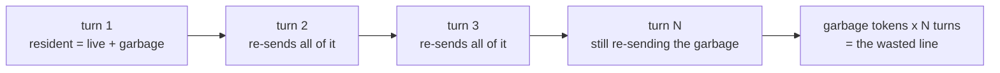
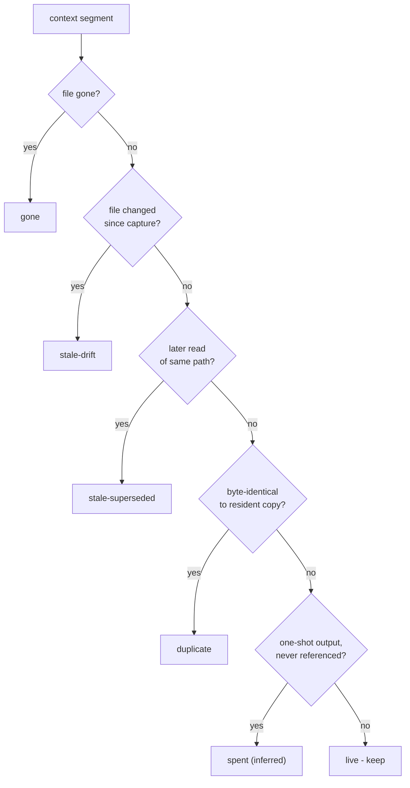
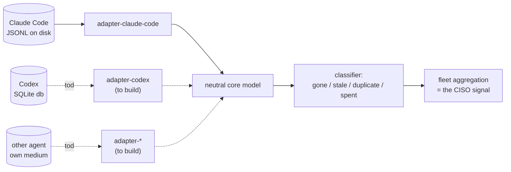

# Context Bloat as a Fleet Signal

> **Q5:** Your memory wedge, applied at the fleet level. You spent two months on lossless memory cleaning. Given intercepted session data across many users, how would you detect and quantify context bloat as an adoption and cost signal a CISO would care about?

## In one paragraph

Every agent session carries a "context window" — the running memory the model is
billed for on each step. A large, measurable slice of that memory is dead:
files that were since deleted or changed, duplicated content, output never used
again. The customer pays for that dead weight repeatedly, and stale source files
sit in a third-party prompt long after they should. Omixy can measure this
fleet-wide, read-only, and report it three ways: wasted spend, who is actually
using agents hard, and sensitive data lingering past its life. The number is
built only from cases we can prove, so it holds up under scrutiny.

For example — here is the session we used for coding this entire project:

## What this is

The claim is narrow and provable: **a measurable fraction of every paid context
window is dead weight that the customer re-pays for on every turn.** Quantify
that fraction across the fleet and you have a cost line, an adoption curve, and a
data-retention signal in one metric.

## Why a CISO cares about "bloat"

Claude Code works in a way that it has a server-side cache which it flushes and writes a new
one. Every single write to that cache is expensive, and before flush if you ask it something
that lies in the cache it costs you 10× less. Now imagine writing old/duplicate/garbage copies
to cache — it costs you more money every cache write turn.

## The mechanism that makes it cost money

A context window is not paid for once. On each turn the agent re-sends the
window to the model as input. So a token that is dead but still resident is
**re-billed every turn until something evicts it**. A 4k-token stale file read
that survives 30 turns is paid for ~30 times, not once.

Prompt caching softens this — cached prefixes are billed at a discount, not
zero — so the honest number is *discounted* re-sends, not full price. Glassbox
reads provider actuals (`analysis/cost`, `analysis/pricing`) rather than list
price, so the wasted figure is grounded in what was actually charged, cache
included.

## How we detect garbage

Garbage is decided per segment of the reconstructed window, not per message. A
segment is reclaimable only when it is **provably** dead or redundant. There are
four such classes, plus one inferred class held separately.

| Class | Meaning | How it is proven |
|-------|---------|------------------|
| `gone` | File content whose file no longer exists | `stat` the path |
| `stale-drift` | A copy outdated because the file changed on disk | file mtime vs. capture time |
| `stale-superseded` | An older copy a later read of the same path replaced | transcript order |
| `duplicate` | A byte-identical repeat of resident content | content hash |
| `spent` | One-shot tool output never referenced again | **inferred**, not proven |

The first four are the **hard floor**: each is backed by a check against ground
truth (the filesystem, a hash, transcript ordering). `spent` is real bloat in
practice but rests on an inference — "never referenced again" cannot be proven
from the transcript — so it is counted, but separately.

This yields a two-tier number, which is what keeps it defensible:

- **Hard bloat** = `gone + stale-drift + stale-superseded + duplicate`. Provable.
  This is the figure you put in front of an auditor.
- **Soft bloat** = `spent`. Reported as an upper band, never folded into the hard number.

## What we do not delete, and why

Two separate disciplines, often confused, both reduce to "we are conservative on purpose."

**1. The fleet signal never mutates anything.** Measuring bloat across
intercepted sessions is strictly read-only. We classify a copy and emit a count.
No user session is touched, forked, or written. The same passive posture omixy
uses on the wire applies here: we only ever read.

**2. Even the cleaner, when it does run, never deletes a block.** The model
vendor's API requires every `tool_use` to keep its matching `tool_result`;
deleting a block would orphan that pair and break the session's ability to
resume. So the cleaner *tombstones* — it replaces only the heavy content with a
short stub and leaves the structural envelope intact. Nothing that would break a
resume is ever removed.

| We do not delete... | Because... |
|---------------------|------------|
| Anything, during fleet measurement | The signal is read-only; mutation is out of scope |
| `tool_use` / `tool_result` blocks | Orphaning the pair breaks resume; we tombstone the payload instead |
| `spent` segments, by default | "Never referenced again" is inferred, not proven; default posture is preserve |
| Live or hot segments | They are the working set; absence of a deadness proof means keep |

The governing default is **preserve unless a positive proof of deadness exists.**
That is the inverse of how naive cleanup works ("delete unless something protects
it"), and it is what lets the bloat number be both safe and trusted.

## Why this is Claude Code only, for now

The classifier above is **tool-neutral**. It runs on glassbox's `core` model —
`Session`, `Message`, `ToolCall`, `FileOp`, `ContextSnapshot`, `Segment` — and on
nothing else. It has no idea what an agent's on-disk format looks like.

The piece that *does* know the raw format is the **adapter**, and there is
exactly one today: `adapter-claude-code`, which parses Claude Code's JSONL
transcript into the neutral model. Every detector, every cost calculation, and
the entire fleet aggregation sit above that line and are agent-agnostic.

Different agents store their memory in different media, so each needs its own
adapter — and that is the *only* per-agent work:

| Agent | Memory medium | Adapter status | What the adapter must do |
|-------|---------------|----------------|--------------------------|
| Claude Code | JSONL transcript file | exists | Map raw events to `Session` / `Segment` |
| Codex | SQLite database | to build | Read rows from the db, emit the same model |
| Others | Varies (db, log, API export) | to build | Same contract, different reader |

So onboarding Codex is not a re-think — the deadness proofs (`stat`, mtime, hash,
ordering) are unchanged. It is a focused job: write `adapter-codex` that opens
the SQLite store, reads the session rows, and produces `ContextSnapshot` and
`Segment` objects the existing classifier already understands. The core stays
common; only the front door is per-agent. Until those adapters exist, the fleet
signal is honestly scoped to the one agent we can already read: Claude Code.

## The metrics the signal produces

Per session, then rolled up across the fleet:

| Metric | Definition | Reads as |
|--------|------------|----------|
| Bloat ratio | hard-bloat tokens / resident tokens | How much of the window is provably dead |
| Wasted spend | hard-bloat tokens, re-billed per turn, at provider actual price | The cost line |
| Soft ceiling | (hard + spent) ratio | Optimistic upper band |
| Stale-exposure count | `gone` + `stale-*` segments carrying file content | Sensitive data lingering past its life |
| Depth distribution | bloat ratio vs. session length, across users | Adoption shape |

The first two are the cost story, the fourth is the security story, and the last
is the adoption story — all from one read-only pass over data omixy is already
intercepting.

## Summary

Bloat is the provably-dead fraction of a paid context window, re-billed every
turn. Glassbox proves deadness four ways against ground truth and holds a fifth,
inferred class separately, so the fleet number has a defensible floor. The
measurement is read-only and the cleaner, when it runs at all, tombstones rather
than deletes, so nothing structural is ever lost. The whole thing is
Claude-Code-only today not by design limit but because the classifier is
tool-neutral and needs one adapter per agent's storage medium — JSONL for Claude
Code, SQLite for Codex — and only the first adapter exists so far.

---

**Next:** [Windows Demo: Capturing Claude Desktop Traffic](/writeups/demo)
