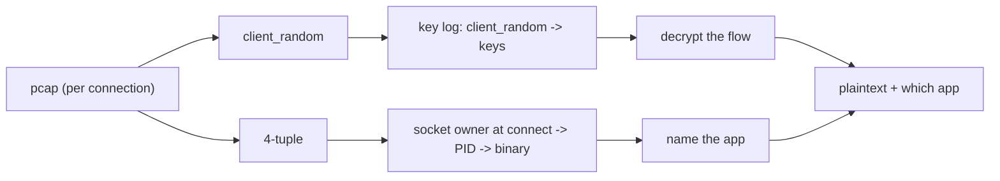

# From Scoped to Global Capture

## The question

Today keyhole launches one app and observes it. Can it instead run as a passive listener for
the whole session — start at login, stop at logout, and capture every in-scope Chromium app
that ran in between? And if every app writes to one key log, how do we tell Claude desktop's
keys from Codex desktop's?

## Going global is one change

Keyhole has two independent halves, and both already work machine-wide:

| Half | Scoped (today) | Global |
|------|----------------|--------|
| Key logging | Set `SSLKEYLOGFILE` for the one app we launch | Set `SSLKEYLOGFILE` **persistently, system-wide**, so every app inherits it |
| Packet capture | Machine-wide passive sniff | Same — run it as a service from login to logout |

So the only change is moving the environment variable from per-launch to a persistent
system-level setting (`/etc/environment` on Linux, `setx /M` or the registry on Windows, a
launchd plist on macOS). After that:

```
login   →  capture service starts; SSLKEYLOGFILE is already in the environment
        →  user opens Claude desktop, Codex desktop, Chrome, Slack — each inherits it
        →  every app writes its keys; the service records every packet
logout  →  capture stops
```

Every Chromium app that **starts during that window** is captured automatically, with no
per-app launching by us. The one rule: the variable must be in the environment before the
apps start, so set it system-wide and let a fresh login pick it up.

## How the keys are separated: they aren't, in the file

Every Chromium app appends to the **same** key log, and a line carries no identity:

```
CLIENT_TRAFFIC_SECRET_0  <client_random>  <secret>
```

There is no app name and no PID in it. Claude desktop, Codex desktop, and Chrome all dump
lines into one shared pool. Separation does not happen in the file — and it does not need to.

## What makes it still work: client_random

Every TLS connection has a unique 32-byte `client_random`. It appears in two places at once:

- the key log line above, and
- the **ClientHello** inside the captured packets.

So the key log is just a lookup table: *given a connection's `client_random`, here are its
keys.* Because `client_random` is unique per connection, decryption never needs to know which
app wrote the key — it matches each connection to its own keys exactly.

## Naming the app: separation happens after decryption

| Layer | How it tells Claude from Codex | Strength |
|-------|--------------------------------|----------|
| **Host** (today) | After decrypting, read the HTTP `:authority`: Claude desktop → `claude.ai`, Codex desktop → OpenAI hosts | Cheap and works for distinct services; blurs when both use shared infra (Cloudflare, Sentry, Google) and never names the process |
| **Socket → PID → binary** (the real fix) | Bind the connection's 4-tuple to the OS socket owner at connect time → PID → `claude.exe` vs `codex.exe` | Definitive; this is the attribution join described in the process attribution post |

## The full chain, in one picture



The capture gives you both the `client_random` (to find the keys) and the 4-tuple (to find the
process). The key log decrypts the flow; the socket-owner record names the app. Join them and
every decrypted flow carries its plaintext and its exact binary.

## Summary

Global capture is just `SSLKEYLOGFILE` set system-wide plus a capture service running across
the session. The keys are **not** separated by app in the log — they are a shared pool keyed by
`client_random`, which is globally unique per connection, so decryption is unambiguous.
Telling which app a decrypted flow belongs to is a separate step: by host as a cheap
heuristic today, or rigorously by binding each connection to its owning process at the moment
the socket opens.
