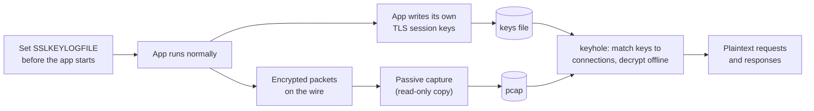

# Approach: Passive Key Logging for Chromium Desktop Apps

> **Q1:** Make it work for all apps, not just the browser. Your demo relied on `SSLKEYLOGFILE` for a browser session. Walk me through how far that env-var approach actually reaches across every app on a machine, and where it stops. Where it stops, what's your fallback, and how do you decide which mechanism handles which traffic?

## What this is

Keyhole is a passive observability tool for **Chromium-based desktop applications** —
Claude desktop, Codex desktop, ChatGPT desktop, and other Electron apps. This scope was
the goal from the start. It is not a general TLS interceptor that falls back to other
techniques; it does one thing, for one class of app, and does it without touching the app.

The method is simple: **don't break the encryption — copy the key the app already writes.**
Chromium honors a built-in debug switch, `SSLKEYLOGFILE`. When that environment variable is
set before the app launches, the app writes its own TLS session keys to a file as part of
normal operation. We hold a copy of those keys, record the encrypted traffic passively, and
decrypt it offline.

## Why it does not break the app

Everything in this approach is passive. Nothing sits in the connection's path.

| Step | What it does | Effect on the app |
|------|--------------|-------------------|
| Set `SSLKEYLOGFILE` | An environment variable, read at process start | If honored, the app writes keys. If not, ignored — a silent no-op. Never changes behavior. |
| Capture packets | Read-only copy of traffic off the wire (AF_PACKET on Linux, pktmon on Windows) | None. We never inject, modify, drop, or delay a packet. |
| Decrypt | Offline, after capture, using the logged keys | None. The app has already finished talking. |

We never present a certificate, never impersonate the server, and never terminate the
connection. The app performs its own normal handshake directly with the real server. Because
nothing is faked and nothing is in the path, certificate pinning is satisfied and the app
cannot tell anything is happening. There is no active MITM step — the one thing that *would*
break a pinned app — anywhere in the design.

## What happens when a message is not recorded

If a particular message or connection is not captured — the app started before the variable
was set, the traffic used a transport we do not decode, or it came from a process that does
not honor the switch — the result is simply that **it is absent from the log**. The entry is
blank; there is no error, no retry, and no effect on the app. The application keeps running
and connecting normally; we just do not have a readable copy of that exchange.

This was observed directly in testing: a single capture held dozens of TLS connections, only
some of which matched logged keys. The connections we could not read continued to work
perfectly. Missing visibility is the only consequence of a miss.

## Mechanism: what we do for the traffic

1. **Flip the switch.** Set `SSLKEYLOGFILE` in the environment, then launch the app so it
   inherits the variable. The app writes its session keys to the file itself.
2. **Copy the ciphertext.** A passive recorder makes a read-only copy of the encrypted
   packets as they leave the machine. It does not interact with the connection in any way.
3. **Decrypt offline.** After capture, keyhole matches each connection to its key (by the
   `client_random` present in both the key file and the captured handshake), derives the
   per-connection keys, decrypts the TLS records, and reassembles the HTTP/2 requests and
   responses. None of this touches the live app.

The traffic itself is never altered. We only ever read: read the keys the app voluntarily
wrote, and read a copy of the packets that were going to be sent anyway.

## There is no fallback

This is deliberate. Keyhole targets Chromium-based desktop apps, which honor `SSLKEYLOGFILE`,
and it relies entirely on that passive path. It does not detect an unsupported app and
escalate to a more invasive technique.

If an application is not Chromium-based and does not honor the switch, it is simply **out of
scope** — we wanted to deliberately only keep chromium based desktop apps in the scope.

---

**Next:** [Not Breaking Certificate-Pinned Apps](/writeups/second)
